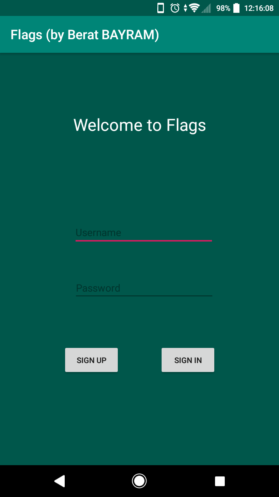
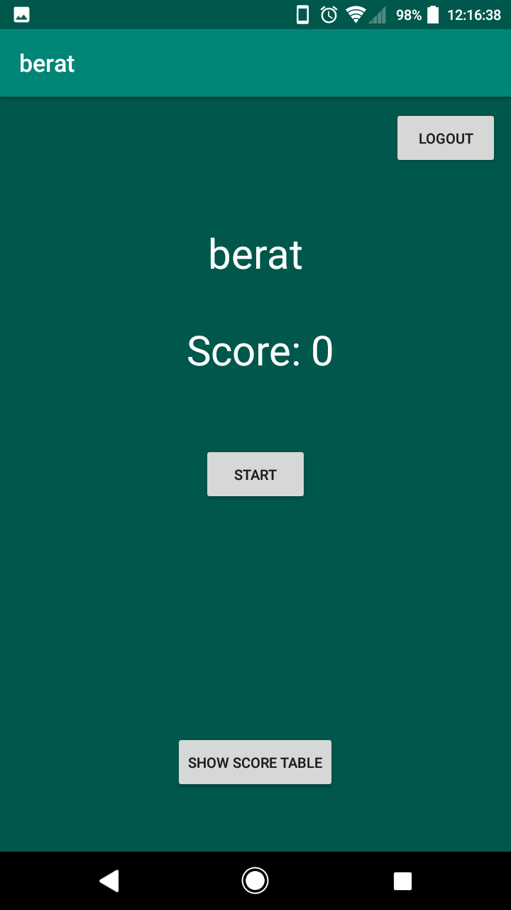
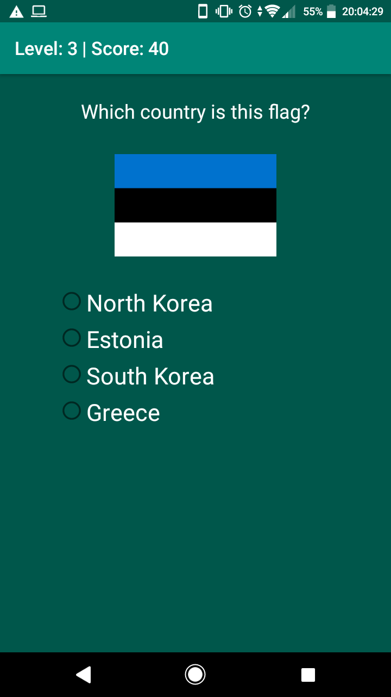
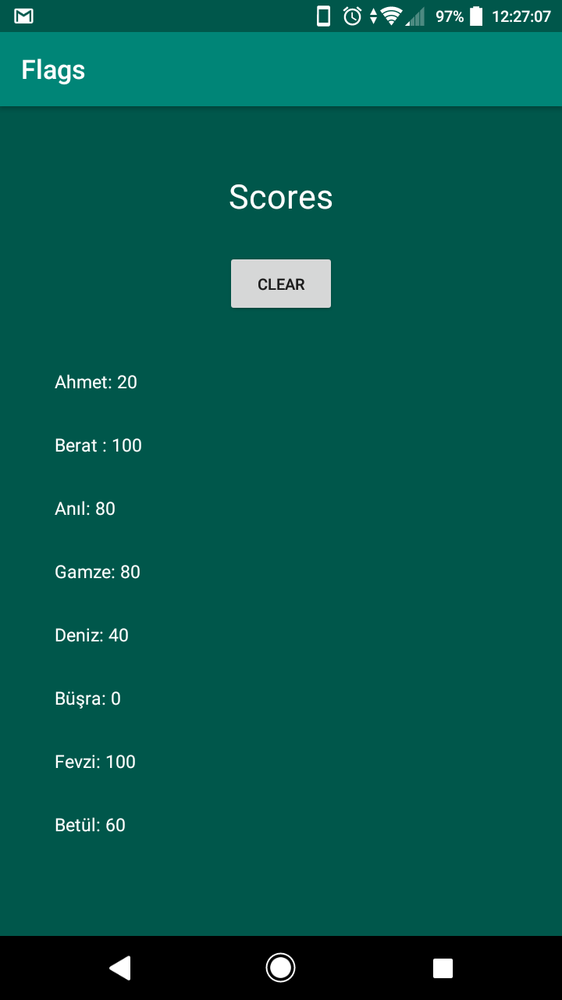

# android-app-sample "flags"

Simple android country-flags quiz app featuring multi-account system  
(An APK also available within this repo)

## Features

* 4 questions
* Login system
* Shared-folders usage for account datas
* Score points
* And a easter egg*

## Screenshots

|  |  |  |  |

---

\* If user answers final question correctly, an interesting fact about the answer will appear below the START button
